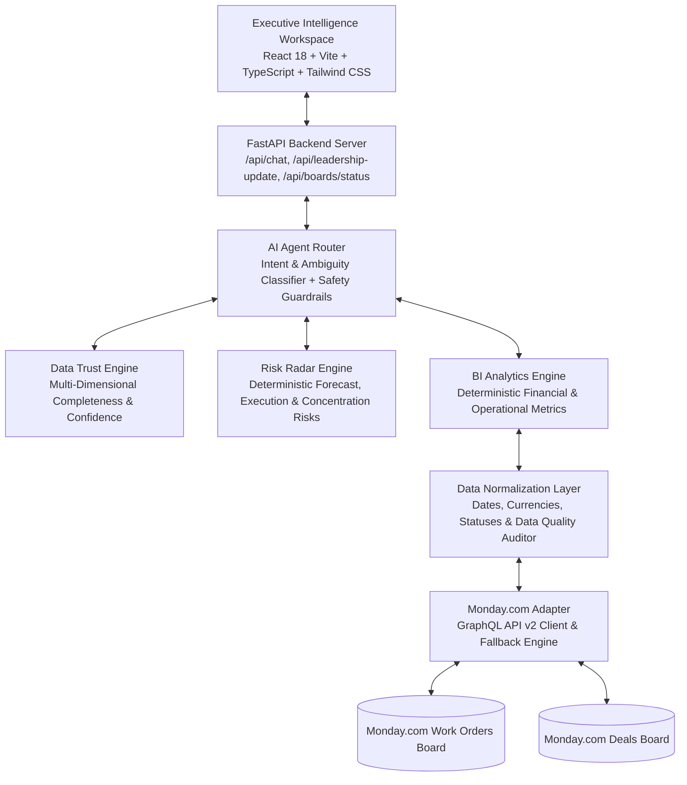

# 🚀 Skylark Executive Intelligence (V2 Shortlist Edition)

> *"Turn messy operational data into decisions leadership can trust."*

**GitHub Repository**: [https://github.com/ramKarthik57/Skylark_Drones_Assessment](https://github.com/ramKarthik57/Skylark_Drones_Assessment)

Executive-level AI Business Intelligence workspace querying Monday.com **Deals** & **Work Orders** boards dynamically with data normalization, deterministic analytics, risk radar engines, data trust metrics, evidence-backed AI insights, and 1-click Leadership Updates.

---

## 🌟 Why This Solution Stands Out

1. **Live Monday.com Integration & Seeding**: Connects directly to Monday.com v2 GraphQL API (`boards`, `items_page`, `column_values`) with an automated seeder (`seed_monday.py`). Strict `APP_ENV=production` guardrails ensure live Monday API execution without silent mock fallbacks.
2. **Data Trust Engine (`data_trust.py`)**: Computes multi-dimensional mathematical trust scores (Completeness, Date Coverage, Probability Rating Coverage, Sector Mapping, Cross-Board Linkage Confidence).
3. **Executive Risk Radar (`risk_engine.py`)**: Deterministic risk signals covering Forecast Risk, Execution Risk, Pipeline Concentration Risk, Data Integrity, and Cross-Board Linkage.
4. **Deterministic BI Engine (`bi_engine.py`)**: Calculates active pipeline (**₹68.82 Cr**), weighted forecast (**₹26.46 Cr**), win rate (**56.5%** across 292 decided opportunities), active work orders (**58 projects**), delayed work orders (**5 projects**), and billed contract value (**₹10.74 Cr**).
5. **Adversarial & Unsupported Query Refusal**: Refuses unsupported business questions (e.g. EBITDA, employee productivity) gracefully, preventing LLM hallucinations.
6. **Evidence-First AI Answers**: Formats AI responses into structured `ANSWER`, `EVIDENCE`, `WHY IT MATTERS`, `DATA QUALITY`, and `RECOMMENDED ACTION`.
7. **37 PyTest Unit & Integration Tests**: 100% test pass rate covering normalizer, BI engine, data quality auditor, risk engine, data trust, agent router, and FastAPI endpoints.

---

## 🏗️ System Architecture



---

## ⚙️ Environment Configuration

Copy `.env.example` to `.env`:

```env
APP_ENV=development
MONDAY_API_TOKEN=your_monday_api_v2_token_here
MONDAY_WORK_ORDERS_BOARD_ID=123456789
MONDAY_DEALS_BOARD_ID=987654321
LLM_API_KEY=your_gemini_api_key_here
LLM_MODEL=gemini-2.5-flash
PORT=8000
USE_MOCK_FALLBACK=true
```

---

## 🚀 Local Setup & Running Instructions

### 1. Backend & PyTest Test Suite
```bash
cd backend
python -m pip install -r requirements.txt
python -m pytest tests          # Runs 37 unit & integration tests
python app/main.py
```
*(Backend runs at `http://localhost:8000` with Swagger docs at `http://localhost:8000/docs`)*

### 2. Frontend
```bash
cd frontend
npm install
npm run build
npm run dev
```
*(Frontend runs at `http://localhost:3000`)*

---

## 📋 Monday.com Setup & Board Seeding

Run the automated board seeder:
```bash
python backend/app/monday/seed_monday.py
```

---

## ❓ Example Executive Demo Queries

- *How is our pipeline looking this quarter?*
- *Which sectors have the strongest pipeline?*
- *Show me delayed projects and active work orders.*
- *Are we selling faster than we can execute?*
- *How are we doing?* (Triggers ambiguity clarification)
- *What is our EBITDA?* (Triggers unsupported query refusal)
- *Prepare a leadership update.*
