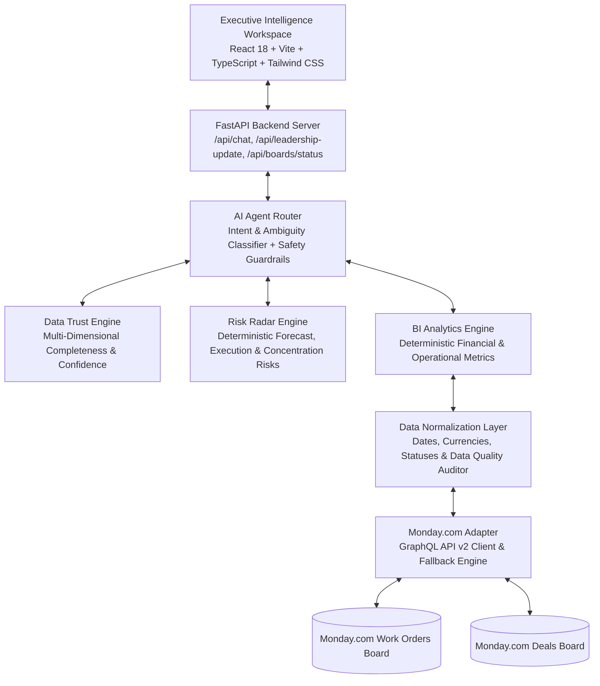

# 🚀 Skylark Executive Intelligence

> *"Turn messy operational data into decisions leadership can trust."*

**GitHub Repository**: [https://github.com/ramKarthik57/Skylark_Drones_Assessment](https://github.com/ramKarthik57/Skylark_Drones_Assessment)

Executive-level AI Business Intelligence workspace querying Monday.com **Deals** & **Work Orders** boards dynamically with data normalization, deterministic analytics, risk radar engines, data trust metrics, evidence-backed AI insights, and 1-click Leadership Updates.

---

## 🏛️ Engineering Principles

1. **Deterministic Computation Over LLM Arithmetic**: 100% of financial, operational, and risk calculations are executed programmatically in Python before LLM synthesis to eliminate hallucinations.
2. **Evidence Before Inference**: Every AI answer is grounded in explicit metrics (`ANSWER`, `EVIDENCE`, `WHY IT MATTERS`, `DATA QUALITY`, `RECOMMENDED ACTION`).
3. **Explicit Data-Quality Caveats**:Messy real-world data issues (missing close dates, unrated deals, delayed projects) are surfaced transparently to leadership rather than hidden.
4. **Secure Server-Side Secret Management**: Credentials and API tokens reside strictly server-side; zero secrets delivered to frontend JavaScript or committed to git.
5. **Graceful Degradation & Adversarial Safety**: Unsupported financial queries (EBITDA, CAC, LTV, salaries) and prompt injection attempts are refused cleanly with structured warning cards.

---

## 🌟 Engineering Highlights & Differentiators

- **Live Monday.com GraphQL v2 Integration**: Queries `boards`, `items_page`, and `column_values` dynamically with automated board seeder (`seed_monday.py`). Strict `APP_ENV=production` mode enforces live API credentials without silent mock fallbacks.
- **Mathematical Data Trust Engine (`data_trust.py`)**: Calculates 5 dataset trust dimensions (Field Completeness, Date Coverage, Probability Rating Coverage, Sector Mapping, Cross-Board Linkage Confidence).
- **Deterministic Executive Risk Radar (`risk_engine.py`)**: Categorizes business risks (Forecast Risk, Execution Risk, Concentration Risk, Linkage Risk) with ground-truth evidence and actionable recommendations.
- **Cross-Board Linkage Audit**: Quantifies deal name matching across CRM Deals and Work Orders tracker boards at **89.7% match rate** (52/58 matched).
- **Automated Test Suite**: **37 PyTest unit and integration tests** in `backend/tests/` passing 100% in 1.70s.
- **Automated CI Workflow**: GitHub Actions workflow (`.github/workflows/ci.yml`) for continuous PyTest validation and Vite production bundle builds.

---

## 🏗️ System Architecture



---

## ⚙️ Environment Configuration

Copy `.env.example` to `.env`:

```env
APP_ENV=development
MONDAY_API_TOKEN=your_monday_api_v2_token_here
MONDAY_WORK_ORDERS_BOARD_ID=123456789
MONDAY_DEALS_BOARD_ID=987654321
LLM_API_KEY=your_gemini_api_key_here
LLM_MODEL=gemini-2.5-flash
PORT=8000
USE_MOCK_FALLBACK=true
```

---

## 🚀 Local Setup & Running Instructions

### 1. Backend & PyTest Test Suite
```bash
cd backend
python -m pip install -r requirements.txt
python -m pytest tests          # Runs 37 unit & integration tests
python app/main.py
```
*(Backend runs at `http://localhost:8000` with Swagger docs at `http://localhost:8000/docs`)*

### 2. Frontend Workspace
```bash
cd frontend
npm install
npm run build
npm run dev
```
*(Frontend runs at `http://localhost:3000`)*

---

## 📋 Monday.com Setup & Board Seeding

Run the automated board seeder:
```bash
python backend/app/monday/seed_monday.py
```

---

## ❓ Example Executive Demo Queries

- *How is our pipeline looking this quarter?*
- *Which sectors have the strongest pipeline?*
- *Show me delayed projects and active work orders.*
- *Are we selling faster than we can execute?*
- *How are we doing?* (Triggers ambiguity clarification)
- *What is our EBITDA?* (Triggers unsupported query refusal)
- *Prepare a leadership update.*
