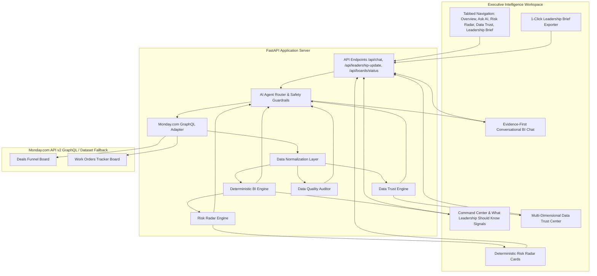

# Skylark Executive Intelligence — V2 System Architecture

## System Workflow
1. **User Navigation / Query**: The user accesses the Executive Command Center or asks a natural language question.
2. **Adversarial / Intent Routing**: `classify_intent_and_entities` detects intent, sector/quarter entities, ambiguous queries (*"How are we doing?"*), or unsupported adversarial queries (e.g. EBITDA).
3. **Monday.com Live Data Fetch**: `MondayClient` queries Monday.com GraphQL API v2. In `APP_ENV=production`, unconfigured tokens raise explicit API errors.
4. **Data Normalization & Trust Evaluation**: Normalizes dates, currencies, and statuses; computes field completeness, date coverage, probability coverage, sector mapping, and cross-board linkage confidence.
5. **Deterministic BI & Risk Engine**: Calculates exact pipeline values, weighted forecast, win rate (56.5%), active work orders (58), delayed projects (5), and risk signals (Forecast Risk, Execution Risk, Concentration Risk).
6. **Evidence-First AI Synthesis**: Generates structured responses with `ANSWER`, `EVIDENCE`, `WHY IT MATTERS`, `DATA QUALITY`, and `RECOMMENDED ACTION`.
7. **Executive UI Workspace**: Renders command signals, interactive Recharts, risk radar cards, data trust scores, and exportable leadership briefings.
